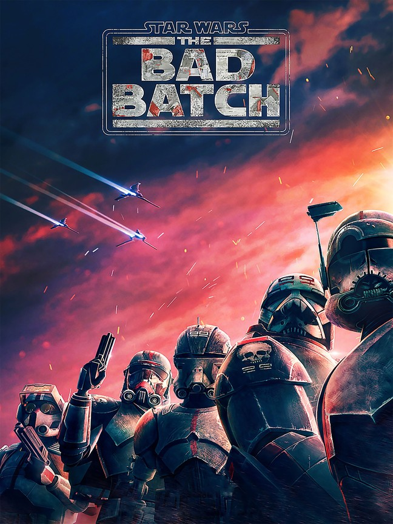

*Star Wars: The Bad Batch* is an animated series that takes place in a **post Order 66** star wars universe. Taking place after the events of *Star Wars Episode III: Revenge of the Sith* Bad Batch shows how a group of clones, Clone Force 99 "*The Bad Batch*", survive and navigate in an early empire era. Clone Force 99 consists of 5 clones, 4 of which have modified versions of the original Jango Fett DNA all clones share. Originally the unit consisted of four clones: Crosshair, Wrecker, Tech, and the leader Hunter. Assisting Jedi Knight Anakin Skywalker and clone trooper CT-7567 "*Rex*" on a rescue mission, the group would welcome CT-1409 "*Echo*", who has been tortured and expiremented on by the Sepratist Alliance.
Following the execution of Order 66, Crosshair's inhibitor chip is the only one that activates, causing him to leave the group to stay with the empire. The group would leave Kamino with the help of Omega, another clone with a modified version of the original Jango Fett DNA. The group do their best to keep a low profile, trying to avoid the Empire.


Left to right: Tech, Hunter, Echo, Wrecker, Crosshair

[IMDB_Reviews](https://www.imdb.com/title/tt12708542/)
[RottenTomato_Reviews](https://www.rottentomatoes.com/tv/star_wars_the_bad_batch/s01)

```java
public static void main(String[] args){
    System.out.println("Star Wars: The Bad Batch");
    System.out.println("Released: 4 May, 2021");
}